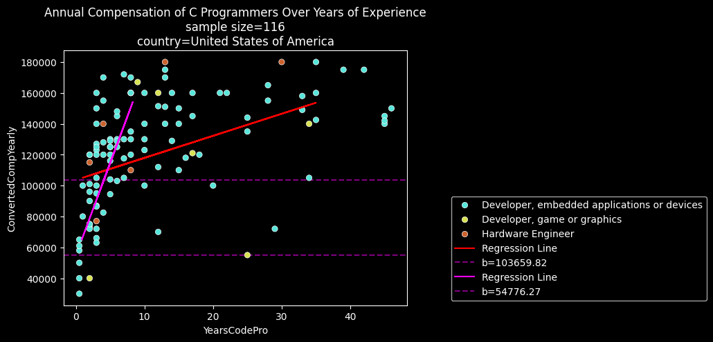
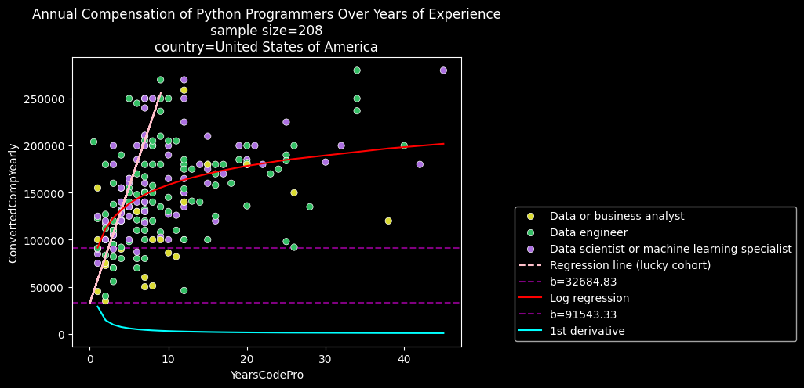

<!--Your Github repository must have the following contents:

    A README.md file that communicates the libraries used, the motivation for the project, the files in the repository with a small description of each, a summary of the results of the analysis, and necessary acknowledgments.

    Your code in a Jupyter notebook, with appropriate comments, analysis, and documentation.

    You may also provide any other necessary documentation you find necessary.-->

# stacksurvey

**stacksurvey** is an exploration and analysis of data from StackOverflow's developer survey of 2024.

[https://survey.stackoverflow.co/2024/](https://survey.stackoverflow.co/2024/)

The motivation for project is satisfying a class assignment. Eventually, an interesting (enough) topic was discovered in the data set: 

>What is the annual compensation (y) over years of experience (x) of deveopers who use a programming language from a specific country?

## Requirements

    numpy pandas sklearn matplotlib seaborn

## Summary of Analysis

The models generated by the notebook become less reliable with years of experience greater than 10 or annual incomes greater than $200,000.

Each chart comes with two regression lines. Red is the default regression line that has not been tuned. The other is an attempt to better fit the data by either transforming or shifting x.

The transformation is typically

    y = m * log(x) + b

where the base is a parameter. 

Each model had different changes of base applied to the log function.

### C

    +----------------------+
    red regression line for C
    coefficient = 1427.58
    intercept = 103659.82
    rmse = 26971.44
    r2 score = 0.06
    sample predictions:
    [[125073.46117519]
    [107942.54574181]
    [109370.12202793]]
    +----------------------+
    +----------------------+
    magenta regression line for C
    coefficient = 11973.47
    intercept = 54776.27
    rmse = 21198.61
    r2 score = 0.57
    sample predictions:
    [[132396.26294684]
    [119937.35465744]
    [ 64985.1549115 ]]
    +----------------------+

For C programmers, a linear model fits well but not great having an r2 score of 0.57. Junior level positions earn roughly $54,776. Their income progresses $11,973 with each year of experience.

### Python

    +----------------------+
    red regression line for Python
    coefficient = 2573.62
    intercept = 123479.15
    rmse = 39759.45
    r2 score = 0.34
    sample predictions:
    [[126052.77118246]
    [174951.60602361]
    [187819.7204555 ]]
    +----------------------+
    +----------------------+
    cyan regression line for Python
    coefficient = 10378.53
    intercept = 82957.69
    rmse = 42374.26
    r2 score = 0.38
    sample predictions:
    [[139882.01866593]
    [117229.55243376]
    [137277.30441955]]
    +----------------------+

For data scientists, analysts, or engineers, a linear model is a moderate fit at best as the r2 score is around 0.30. There appears to be divergence at the 10 year mark in their careers. This may be the result of their field (advertising, finance, bio/medical, and so on).

Entry or junior level professionals generally have an income of $82,957 or $123,479. Their annual income increases by $10,378 or $2573 each year. 

## Acknowledgements

* "Udacity AI" (ChatGPT), the idea to transform x values to appropriate a linear regression into a logarithmic regression.

