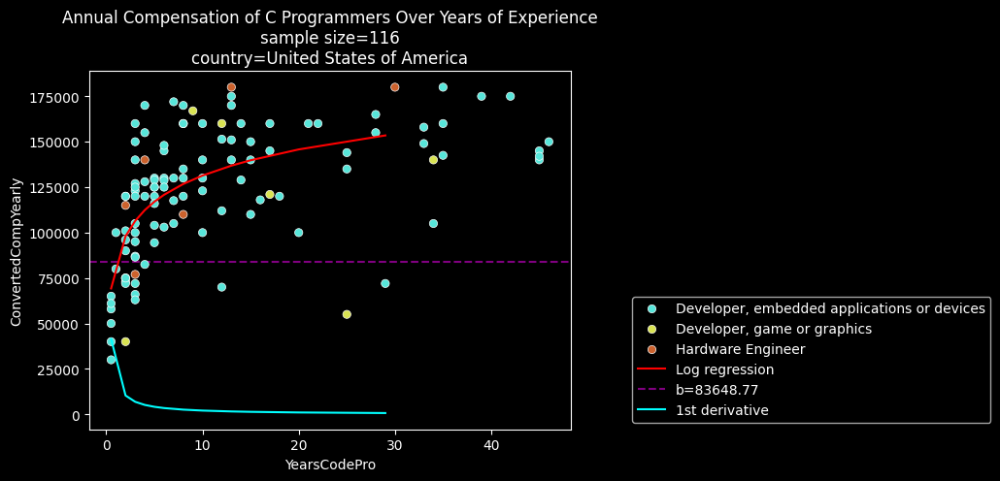

<!--Your Github repository must have the following contents:

    A README.md file that communicates the libraries used, the motivation for the project, the files in the repository with a small description of each, a summary of the results of the analysis, and necessary acknowledgments.

    Your code in a Jupyter notebook, with appropriate comments, analysis, and documentation.

    You may also provide any other necessary documentation you find necessary.-->

# stacksurvey

**stacksurvey** is an exploration and analysis of data from StackOverflow's developer survey of 2024.

[https://survey.stackoverflow.co/2024/](https://survey.stackoverflow.co/2024/)

The motivation for project is satisfying a class assignment. Eventually, an interesting (enough) topic was discovered in the data set: 

>What is the annual compensation (y) over years of experience (x) of developers who use a programming language from a specific country?

## Requirements

    numpy pandas sklearn matplotlib seaborn

## Summary of Analysis

The models generated by the notebook become less reliable with years of experience greater than 10 or annual incomes greater than $200,000.

Each chart has a red line for the logarithmic regression and a cyan line which is the derivative of the regression line.

### C

    +----------------------+
    red log regression line for C
    coefficient = 20734.28
    intercept = 83648.77
    rmse = 17490.15
    r2 score = 0.75
    sample predictions:
    [[ 98020.67915334]
    [106427.70806024]
    [106427.70806024]]
    +----------------------+

C developers have an income starting around $83,648.77. The model can be off by $17,490.15. With an r2 score of 0.75, the model can make good predictions.

### Python

    +----------------------+
    red log regression line for Python
    coefficient = 28995.42
    intercept = 91543.33
    rmse = 30814.08
    r2 score = 0.65
    sample predictions:
    [[123398.04864925]
    [123398.04864925]
    [131739.51024811]]
    +----------------------+

Python developers have an income starting around $91,543.33. The model can be off by $30,814.08. With an r2 score of 0.65, the model can also make good predictions but not as well with C developers.

## Acknowledgements

"Udacity AI" (ChatGPT), the idea to transform x values to appropriate a linear regression into a logarithmic regression.

